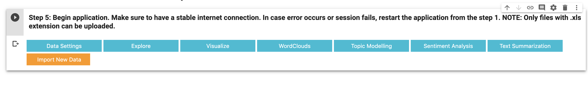
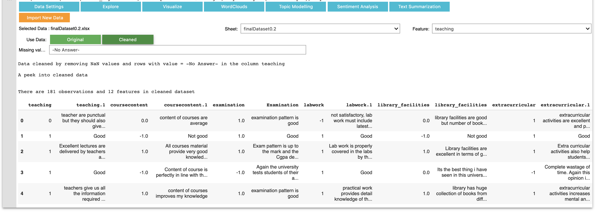
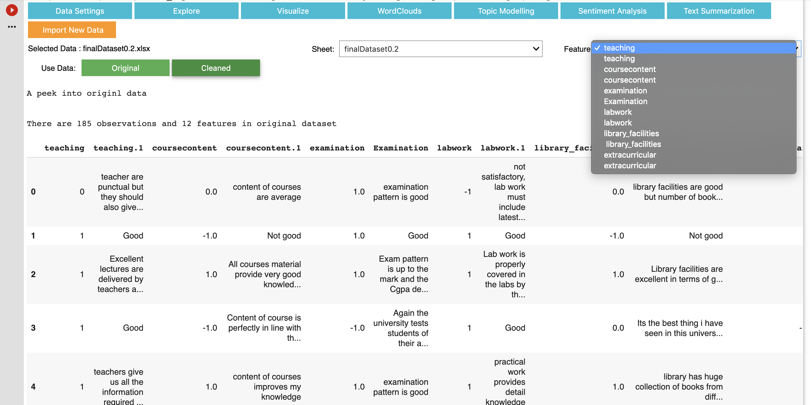
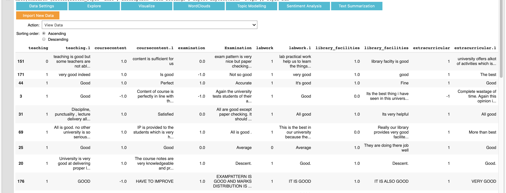

- This tool was developed as a part of the University of Queensland Student-Staff partnership project.
- The tool helps the staff to analyse and visualise the student feedback data about engineering courses through topic modelling, text mining and opinion mining.
- The application was developed in Python.
- The application runs on Google Colab and can be accessed from the following link: https://colab.research.google.com/drive/126ykrAosZIhkzC9r5m-jkY9UevgjtP0I
- Execute all the steps from 1 to 5 before application starts.

# Demo

- The student feedback data from a prominent university in India was analysed with the help of the tool. The data is available on Kaggle and can be downloaded from the link https://www.kaggle.com/brarajit18/student-feedback-dataset/downloads/student-feedback-dataset.zip/1

- Download the data and run the application on Google Colab. Run all the cells from 1 to 5 in the colab notebook.
- Once application starts executing, import the feedback data. Note: the application only accepts .xls file (data in excel file format)

- The 'Data Settings' tab provides options to clean the data by removing NaN values and missing values in the rows for the 'Feature' (Column name) selected. Missing values can be specified in the 'Missing Value' text box.

- Data can be cleaned by clicking on 'Cleaned tab'. If cleaned, cleaned data will be used for analysis. To use original data for analysis purposes, click on 'Original' tab under the 'Data Settings'. To use a different column for data cleaning, choose the column from 'Feature' drop down box.

- Use Explore tab to view data/sort data/group data by 'Feature' selected.

